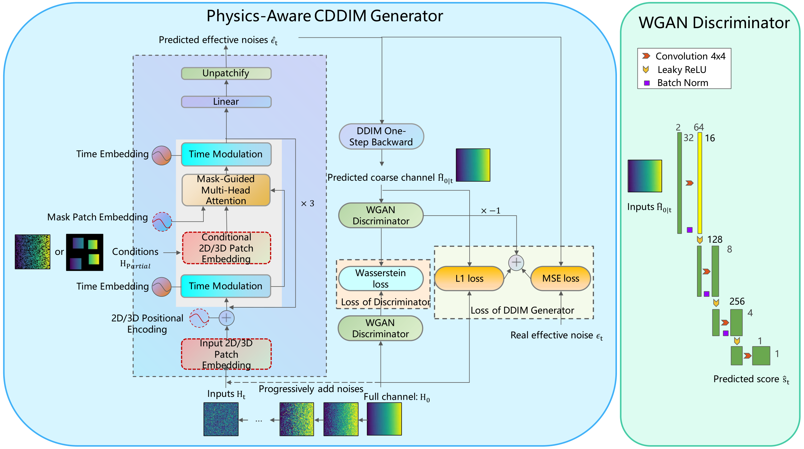
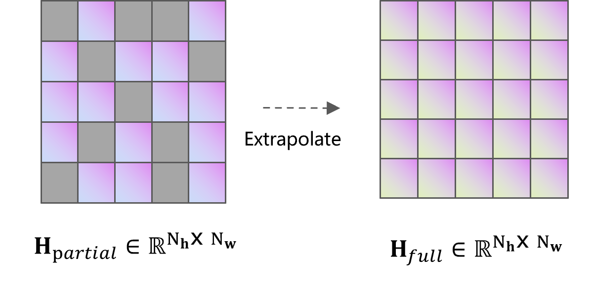
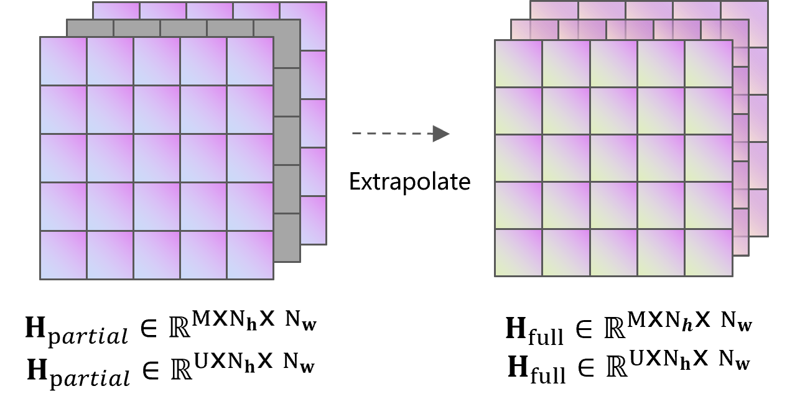

# XL-ChannelDiff

### An Efficient Diffusion-Based Multi-Domain Near-Field Channel Extrapolation Framework for XL-MIMO Systems

**Mengyuan Li, Yu Han, Hao Xu, Yongxu Zhu, Chao-Kai Wen, and Shi Jin**  
*IEEE Transactions on Wireless Communications*, vol. 25, 2026

[Paper](https://ieeexplore.ieee.org/document/11631639) | [DOI](https://doi.org/10.1109/TWC.2026.3716401) | [Dataset](https://huggingface.co/datasets/lmyxxn/XL-Diff) | [Pretrained checkpoint](checkpoints/paper_original/model_best.pt) | [Citation](#citation)

XL-ChannelDiff reconstructs complete near-field channels from partial channel observations using a conditional diffusion model. The framework combines a physics-aware Transformer backbone, mask-guided attention, WGAN-based supervision and sampling guidance, and RePaint-style refinement.

This repository provides the PyTorch implementation for antenna-domain channel extrapolation, together with the original pretrained checkpoint, dataset, and training and evaluation scripts.

## Framework



*Overview of the WGAN-enhanced conditional diffusion framework from the original paper.*

<table>
  <tr>
    <td align="center" width="50%"></td>
    <td align="center" width="50%"></td>
  </tr>
  <tr>
    <td align="center">(a) 2D antenna-domain extrapolation</td>
    <td align="center">(b) 3D frequency- and spatial-domain extrapolation</td>
  </tr>
</table>

*Multi-domain channel extrapolation tasks from the original paper. Gray entries denote unknown channels.*

## Installation

Use a CUDA-enabled GPU with compatible PyTorch, CUDA, and xFormers versions.

```bash
git clone https://github.com/Lmyxxn/XL-Diff.git
cd XL-Diff
pip install -r requirements.txt
```

Run the following commands from the repository root.

## Dataset

Download the original training and test files from
[Hugging Face: lmyxxn/XL-Diff](https://huggingface.co/datasets/lmyxxn/XL-Diff/tree/main).
Create a `data/` directory in the project root and place both files there,
keeping their filenames unchanged:

| File | Use | Size |
| --- | --- | --- |
| [CDL-C_Nt1_Nr1024_QuaRIGA_UPA0.50_seed1234.mat](https://huggingface.co/datasets/lmyxxn/XL-Diff/resolve/main/CDL-C_Nt1_Nr1024_QuaRIGA_UPA0.50_seed1234.mat?download=true) | Training and normalization | Approximately 1.59 GB |
| [CDL-C_Nt1_Nr1024_QuaRIGA_UPA0.50_seed4321.mat](https://huggingface.co/datasets/lmyxxn/XL-Diff/resolve/main/CDL-C_Nt1_Nr1024_QuaRIGA_UPA0.50_seed4321.mat?download=true) | Validation and evaluation | Approximately 31.83 MB |

```text
XL-Diff/
  data/
    CDL-C_Nt1_Nr1024_QuaRIGA_UPA0.50_seed1234.mat
    CDL-C_Nt1_Nr1024_QuaRIGA_UPA0.50_seed4321.mat
  checkpoints/
    paper_original/
      model_best.pt
```

Each sample represents the first-subcarrier channel as a `32 x 32` complex-valued array. Place both files in `data/`: the training file supplies the normalization statistics used during evaluation.

## Pretrained Evaluation

The original checkpoint is included at `checkpoints/paper_original/model_best.pt`.

```bash
python evaluate.py --train CDL-C --test CDL-C --ddim_steps 50 --output_root results/paper_50steps
```

Set `--ddim_steps` to `5`, `50`, or `100` to evaluate different sampling budgets. The script evaluates the configured masking ratios and writes metrics to the specified output directory.

To use a different checkpoint:

```bash
python evaluate.py --train CDL-C --test CDL-C --ddim_steps 50 --checkpoint /absolute/path/to/model_best.pt --output_root results/custom
```

## Baseline Evaluation

Evaluate Random, Partial (zero filling), and 2D DFT-OMP on the same 200 test channels and observation masks:

```bash
python evaluate_baseline.py --data_root data --output_root results/baselines --sparsity 16 --seed 42
```

`--sparsity` controls the number of OMP coefficients (default: 64). Random retains observed entries and fills missing entries with Gaussian noise using the original baseline's scaling. Results are saved in `baseline_summary.csv` and `baseline_nmse_per_sample.npy`; observation masks are saved in `masks.npy`.

## Training

```bash
python train.py --gpu 0 --train CDL-C --seed 42 --output_root outputs/run
```

Checkpoints are saved in a configuration-specific subdirectory under `--output_root`. Training maintains `model_best.pt`, selected by validation noise-reconstruction loss, and `model_latest.pt` for resuming.

To resume while retaining the model, optimizer, discriminator, and EMA states:

```bash
python train.py --gpu 0 --train CDL-C --seed 42 --output_root outputs/run --resume /absolute/path/to/model_latest.pt
```

## Repository Structure

| Path | Description |
| --- | --- |
| `train.py` | Training and checkpoint resumption |
| `evaluate.py` | NMSE evaluation with configurable DDIM sampling steps |
| `evaluate_baseline.py` | Random, Partial, and OMP evaluation |
| `loaders.py` | Dataset loading, normalization, and observation masks |
| `cgan_enhanced_ddim.py`, `ddpm.py` | Conditional diffusion and sampling |
| `DiT/` | Diffusion Transformer backbone |
| `GAN/` | Time-conditioned discriminator |
| `ema.py` | Exponential moving average utilities |
| `data/` | Downloaded training and evaluation datasets |
| `checkpoints/paper_original/` | Original pretrained checkpoint |
| `assets/` | Figures from the original paper |

## Citation

If you use this code or dataset, please cite:

> M. Li, Y. Han, H. Xu, Y. Zhu, C.-K. Wen, and S. Jin, "XL-ChannelDiff: An Efficient Diffusion-Based Multi-Domain Near-Field Channel Extrapolation Framework for XL-MIMO Systems," *IEEE Transactions on Wireless Communications*, vol. 25, 2026, doi: [10.1109/TWC.2026.3716401](https://doi.org/10.1109/TWC.2026.3716401).

```bibtex
@article{li2026xlchanneldiff,
  author = {Mengyuan Li and Yu Han and Hao Xu and Yongxu Zhu and Chao-Kai Wen and Shi Jin},
  title = {{XL-ChannelDiff}: An Efficient Diffusion-Based Multi-Domain Near-Field Channel Extrapolation Framework for {XL-MIMO} Systems},
  journal = {IEEE Transactions on Wireless Communications},
  volume = {25},
  year = {2026},
  doi = {10.1109/TWC.2026.3716401},
  url = {https://ieeexplore.ieee.org/document/11631639}
}
```

## Contact

For questions, please contact Mengyuan Li at [mengyuan_li@seu.edu.cn](mailto:mengyuan_li@seu.edu.cn). Bug reports and suggestions are welcome through [GitHub Issues](https://github.com/Lmyxxn/XL-Diff/issues).
